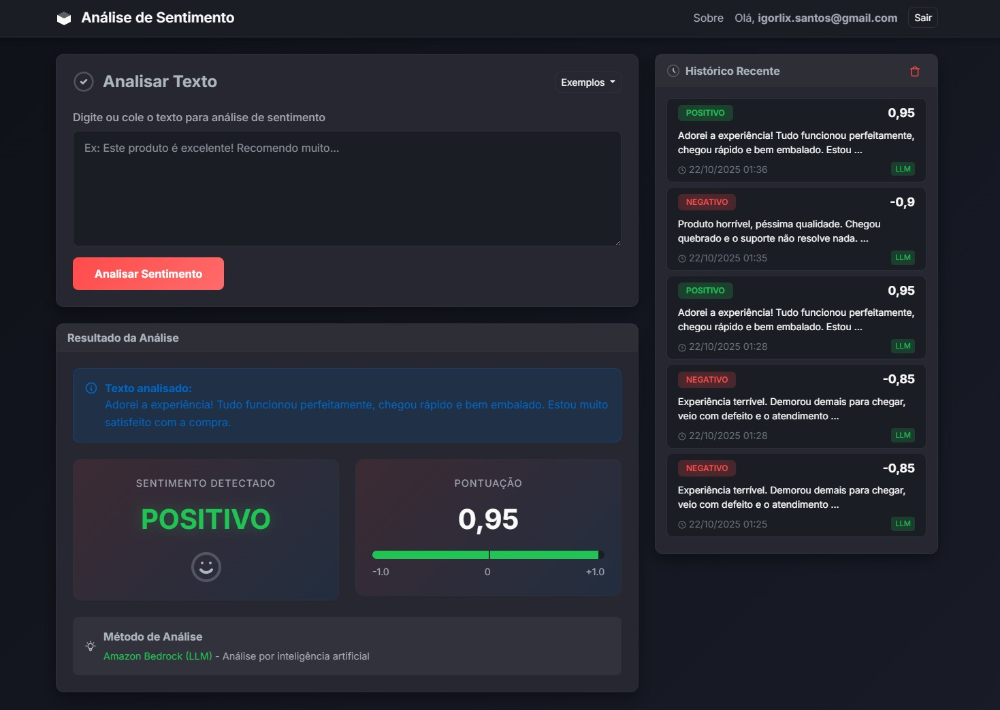

# ESC Engenharia - Exercícios 
Este repositório contém as soluções que desenvolvi para os exercícios 1-6 do programa de estágio na ESC Engenharia. Os códigos e suas respectivas documentações estão separados em pastas.

## Links:
A seguir estão os links para cada exercício juntamente com uma descrição para cada solução.

### [Exercício 1:](https://github.com/igorlix/ESC-Engenharia_Exercicios/tree/main/exercicio1_emails)
Fiz um método simples utilizando regex (expressão regular), a ideia é buscar os valores de domínio (+@[a-zA-Z0-9.-]...) e retorná-los posteriormente.

### [Exercício 2:](https://github.com/igorlix/ESC-Engenharia_Exercicios/tree/main/exercicio2_classificador_spam/classificador_spam.ipynb)

Desenvolvi um modelo classificador de spam com as etapas específicadas, as explicações estão no próprio notebook. 

No geral, a solução não é muito complexa, principalmente por utilizar um dataset limpo (gostaria que todos fossem assim). Para spams em português, utilizo a api do google tradutor para traduzir e então classificá-los.

### [Exercício 3:](https://github.com/igorlix/ESC-Engenharia_Exercicios/tree/main/exercicio3_app_streamlit)

Não conhecia o streamlit e gostei bastante. Demorei um pouco mais do que devia nessa etapa, mas fiquei satisfeito com o resultado, a solução é funcional e bonita visualmente. 

Caso tenha interesse este é o link do deploy pelo próprio streamlit: [exercicio3-app-streamlit](https://igorlix-esc-engenharia-exerc-exercicio3-app-streamlitapp-wktjjr.streamlit.app/)

### [Exercício 4:](https://github.com/igorlix/ESC-Engenharia_Exercicios/tree/main/exercicio4_bedrock)

Para o LLM, utilizei o AWS Bedrock com Amazon Nova Micro. Os detalhes estão especificados no README do exercício. Testei e obtive resposta, mas a recente instabilidade da AWS pode impactar o funcionamento. 

### [Exercício 5:](https://github.com/igorlix/ESC-Engenharia_Exercicios/tree/main/exercicio5_web_django)

Me diverti bastante aqui, a análise com LLM foi tranquila de se executar. Gastei a maior parte do tempo com o visual da página. 

### [Exercício 6:](https://github.com/igorlix/ESC-Engenharia_Exercicios/tree/main/exercicio6_rag_normas)

Por fim, nesse exercício o assistente virtual recebe os dados da pasta "documentos" nos formatos "txt" e "pdf", optei por utilizar as normas do INMETRO. Também inclui as consultas de teste.

Para a busca faço o embedding dos textos com o Cohere Embed v4 via AWS Bedrock, busco por vetores (busca cosseno) o e utilizo o Amazon Nova Micro como LLM

Tentei criar uma interface para o assistente, mas não terminei a tempo. Ainda assim, é completamente funcional pelo terminal. 

